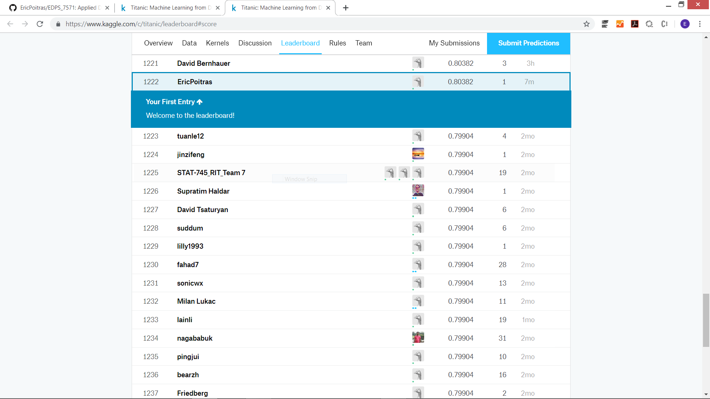
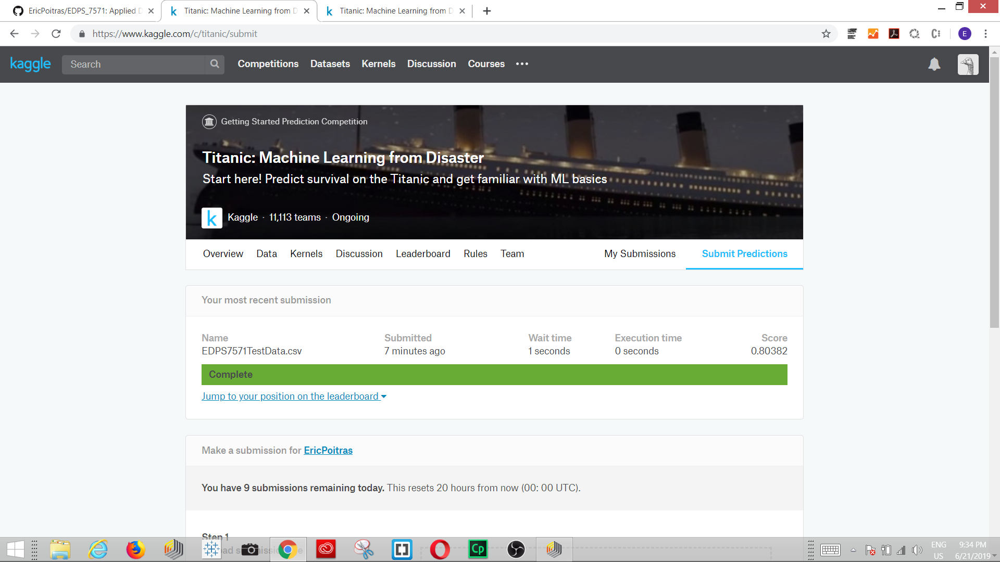

# EDPS 7571 Foundations of Applied Data Analytics and Visualization
This course introduces graduate students to the fundamental theory and techniques in data analytics. The course covers practical examples in relation to the tools and techniques of data mining and visualization, covering the following areas: open-source JavaScript libraries for building interactive dashboards and the RapidMiner data science platform for data preparation, machine learning, and predictive model deployment. At the end of the semester, students are expected to demonstrate their knowledge by developing a static dashboard to showcase their solution to the Kaggle Titanic Data Mining Competition. An emphasis is placed throughout the course on establishing effective data pipelines for training and testing predictive models and assumes no prior programming experience.

# Software Installation - Getting Started on Your Own Static Dashboard

Step 1: Install RapidMiner: https://docs.rapidminer.com/latest/studio/getting-started/

Step 2: Apply for an Academic License: https://rapidminer.com/educational-program/

Step 3: Install Code Editor: http://brackets.io/

Step 4: Setup a Few Scripts Using ApexCharts.js and the Bootstrap 4 Libraries
 - Bootstrap: https://getbootstrap.com/docs/4.3/getting-started/introduction/ (for alternatives, check out - Materialize.css : https://materializecss.com/ or tailwind.css: https://tailwindcss.com/)
 - ApexCharts: https://apexcharts.com/docs/installation/
 
 Step 5: Setup a GitHub Repo: https://github.com/join

# Kaggle Titanic Data Mining Competition

https://www.kaggle.com/c/titanic/overview/evaluation

# Dataset

Kaggle Train: https://ericpoitras.github.io/EDPS_7571/dataset/train.txt

Kaggle Test: https://ericpoitras.github.io/EDPS_7571/dataset/test.txt

Opendatasoft: https://public.opendatasoft.com/explore/dataset/titanic-passengers/table/

Opendatasoft API (Full): https://public.opendatasoft.com/api/records/1.0/search/?dataset=titanic-passengers&rows=900&sort=-passengerid&facet=survived&facet=pclass&facet=sex&facet=age&facet=embarked 

# Instructions

Goal
It is your job to predict if a passenger survived the sinking of the Titanic or not. 
For each in the test set, you must predict a 0 or 1 value for the variable.

Metric
Your score is the percentage of passengers you correctly predict. This is known simply as "accuracy”.

Submission File Format
You should submit a csv file with exactly 418 entries plus a header row. Your submission will show an error if you have extra columns (beyond PassengerId and Survived) or rows.

The file should have exactly 2 columns:

PassengerId (sorted in any order)
Survived (contains your binary predictions: 1 for survived, 0 for deceased)
PassengerId,Survived
 892,0
 893,1
 894,0
 Etc.
 
 Example: https://ericpoitras.github.io/EDPS_7571/assets/EDPS7571TestData.csv
 
 # Moving Beyond the Course - Building Dynamic Dashboards Using RapidMiner Server
 
 Setting Up Local Server Environment for Testing Purposes (Images are Available in AWS and Azure):
 https://www.apachefriends.org/index.html
 
 Setting Up POST REST API on RapidMiner Server:
 https://community.rapidminer.com/discussion/37418/sending-json-data-to-a-rapidminer-service-through-a-post-rest-api-call
 
 Setting Up Fetch Call from the Dashboard to Get Data:
 https://developer.mozilla.org/en-US/docs/Web/API/Fetch_API
 
 # Cost-Effective Example #1 - Using BigML to Build Dynamic Dashboards
 
 Getting Started with BigML
 https://bigml.com/education/videos
 
 Example API Integration with Dashboard
 https://ericpoitras.github.io/EDPS_7571/bigml/#
 
# Cost-Effective Example #2 - Using RapidMiner AutoModel Cloud to Build Dynamic Dashboards (BETA)

Getting Started with RapidMiner AutoModel Cloud
https://rapidminer.com/blog/scoring-data-with-rapidminer-auto-model-and-zapier/

Creating an API
https://automodel.rapidminer.com/ (Available to Educational Accounts as a Premium Service)

Example API Call
https://reqbin.com/eur0ypj0

# Testing Your API

Add Endpoint and Data
https://reqbin.com/

# Finding Datasets

Google Dataset Search: https://toolbox.google.com/datasetsearch

Educational Datasets: https://knoema.com/atlas/topics/Education/datasets

Educational Data Mining Competitions: https://www.kaggle.com/tags/education

State of Utah - Open Data Portal: https://opendata.utah.gov/
